# p3_budman C4 Architecture Model

## System Context Diagram

## Container Diagram

```mermaid
graph TB
    subgraph "p3_budman Budget Manager System"
        CLI[🖥️ CLI Interface<br/>BudManCLIView<br/>cmd2 + argparse]
        
        subgraph "Application Layer"
            App[🎯 BudManApp<br/>Main Application<br/>Singleton Orchestrator]
            Settings[⚙️ BudManSettings<br/>Configuration Management<br/>JSONC Support]
        end
        
        subgraph "MVVM Architecture"
            ViewModel[🧠 BudManViewModel<br/>Business Logic<br/>Command Processing]
            Model[📊 BudgetDomainModel<br/>Domain Logic<br/>Budget Data Model]
            DataContext[🗃️ BDMDataContext<br/>Data Access Layer<br/>FI Management]
        end
        
        subgraph "Workflow Engine"
            Workflows[⚡ Workflow Engine<br/>budget_categorization<br/>budget_intake<br/>budget_mapping]
            CommandProcessor[🎮 Command Processor<br/>CMD_OBJECT Execution<br/>Validation & Parsing]
        end
        
        subgraph "Data Layer"
            StorageModel[💾 BudgetStorageModel<br/>File System Operations<br/>Excel/CSV Processing]
            Workbooks[📚 Workbook Manager<br/>Excel File Processing<br/>openpyxl + pandas]
        end
        
        subgraph "External Dependencies"
            FileSystem[💾 File System<br/>Budget Data Storage<br/>Folder-based Pipeline]
            ExcelFiles[📊 Excel/CSV Files<br/>Bank Transaction Data<br/>Financial Institution Data]
        end
    end
    
    %% User interaction
    User[👤 Budget Manager User] -->|"CLI Commands"| CLI
    
    %% Internal connections
    CLI --> App
    App --> ViewModel
    App --> Settings
    ViewModel --> Model
    ViewModel --> DataContext
    ViewModel --> CommandProcessor
    CommandProcessor --> Workflows
    Model --> StorageModel
    StorageModel --> Workbooks
    DataContext --> Model
    
    %% External connections
    Workbooks --> ExcelFiles
    StorageModel --> FileSystem
    Workflows --> FileSystem
```

## Component Diagram - Core Application

```mermaid
graph TB
    subgraph "p3_budman Core Application Components"
        subgraph "CLI Layer"
            CLIParser[📝 BudManCLIParser<br/>Command Argument Parsing<br/>argparse Integration]
            CLIView[🖥️ BudManCLIView<br/>Interactive CLI Interface<br/>cmd2 Framework]
            CLIOutput[📤 CLI Output Handler<br/>Rich Console Formatting<br/>Command Results]
        end
        
        subgraph "Application Core"
            MainApp[🎯 BudManApp<br/>Application Singleton<br/>Dependency Injection]
            AppSettings[⚙️ BudManSettings<br/>Configuration Management<br/>JSONC Configuration]
        end
        
        subgraph "MVVM Components"
            ViewModel[🧠 BudManViewModel<br/>Business Logic Layer<br/>Command Execution]
            DomainModel[📊 BudgetDomainModel<br/>Domain Business Logic<br/>Budget Data Management]
            DataContext[🗃️ BDMDataContext<br/>Data Access Abstraction<br/>FI Context Management]
        end
        
        subgraph "Command Processing"
            CommandProcessor[🎮 Command Processor<br/>CMD_OBJECT Execution<br/>Command Validation]
            CommandServices[🔧 Command Services<br/>Business Operations<br/>Workflow Integration]
        end
        
        subgraph "Workflow Engine"
            Categorization[🏷️ Budget Categorization<br/>Transaction Categorization<br/>Pattern Matching]
            Intake[📥 Budget Intake<br/>Data Ingestion<br/>File Processing]
            Mapping[🗺️ Category Mapping<br/>Transaction Mapping<br/>Rule Engine]
            CategoryManager[📋 TXN Category Manager<br/>Category Management<br/>Rule Configuration]
        end
        
        subgraph "Data Management"
            StorageModel[💾 BudgetStorageModel<br/>File System Operations<br/>Data Persistence]
            WorkbookManager[📚 Workbook Manager<br/>Excel File Operations<br/>Data Processing]
            FileTree[🌳 File Tree Manager<br/>Directory Structure<br/>Folder Management]
        end
        
        subgraph "External Integrations"
            ExcelProcessor[📊 Excel Processor<br/>openpyxl Integration<br/>Data Extraction]
            PandasProcessor[🐼 Pandas Processor<br/>Data Analysis<br/>Data Manipulation]
            LoggingSystem[📝 Logging System<br/>p3logging Integration<br/>Application Logging]
        end
    end
    
    %% CLI Layer connections
    CLIView --> CLIParser
    CLIView --> CLIOutput
    CLIView --> ViewModel
    
    %% Application Core connections
    MainApp --> ViewModel
    MainApp --> AppSettings
    MainApp --> DataContext
    
    %% MVVM connections
    ViewModel --> DomainModel
    ViewModel --> DataContext
    ViewModel --> CommandProcessor
    
    %% Command Processing connections
    CommandProcessor --> CommandServices
    CommandServices --> Categorization
    CommandServices --> Intake
    CommandServices --> Mapping
    
    %% Workflow connections
    Categorization --> CategoryManager
    Intake --> WorkbookManager
    Mapping --> CategoryManager
    
    %% Data Management connections
    DomainModel --> StorageModel
    StorageModel --> WorkbookManager
    StorageModel --> FileTree
    
    %% External Integration connections
    WorkbookManager --> ExcelProcessor
    ExcelProcessor --> PandasProcessor
    MainApp --> LoggingSystem
```

## Component Diagram - Data Flow

```mermaid
graph LR
    subgraph "Data Processing Pipeline"
        Raw[📁 Raw Data<br/>Original Bank Files<br/>Read-Only]
        Incoming[📥 Incoming Folder<br/>New Transaction Data<br/>Processing Queue]
        Categorized[🏷️ Categorized Folder<br/>Processed Transactions<br/>With Categories]
        Processed[✅ Processed Folder<br/>Final Budget Data<br/>Ready for Analysis]
    end
    
    subgraph "Financial Institution Structure"
        FI[🏦 Financial Institution<br/>Bank/Brokerage]
        Raw --> Incoming
        Incoming --> Categorized
        Categorized --> Processed
    end
    
    subgraph "Workflow Processing"
        IntakeWorkflow[📥 Intake Workflow<br/>Data Ingestion]
        CategorizationWorkflow[🏷️ Categorization Workflow<br/>Transaction Categorization]
        ProcessingWorkflow[⚙️ Processing Workflow<br/>Data Transformation]
    end
    
    %% Workflow connections
    Incoming --> IntakeWorkflow
    IntakeWorkflow --> CategorizationWorkflow
    CategorizationWorkflow --> ProcessingWorkflow
    ProcessingWorkflow --> Processed
```

## Component Diagram - Command Structure

```mermaid
graph TB
    subgraph "Command Architecture"
        subgraph "CLI Commands"
            AppCmd[⚙️ app<br/>Application Settings]
            ChangeCmd[🔄 change<br/>Data Modification]
            ListCmd[📋 list<br/>Data Listing]
            LoadCmd[📥 load<br/>Data Loading]
            SaveCmd[💾 save<br/>Data Saving]
            ShowCmd[👁️ show<br/>Data Display]
            WorkflowCmd[⚡ workflow<br/>Workflow Execution]
        end
        
        subgraph "Workflow Subcommands"
            Categorization[🏷️ categorization<br/>Transaction Categorization]
            Check[✅ check<br/>Data Validation]
            Reload[🔄 reload<br/>Module Reloading]
            Transfer[📤 transfer<br/>Data Transfer]
        end
        
        subgraph "Command Processing"
            CmdObject[📦 CMD_OBJECT<br/>Command Structure]
            CmdResult[📊 CMD_RESULT<br/>Command Response]
            Validation[✅ Command Validation<br/>Parse & Validate]
            Execution[⚡ Command Execution<br/>Business Logic]
        end
    end
    
    %% Command flow
    AppCmd --> CmdObject
    ChangeCmd --> CmdObject
    ListCmd --> CmdObject
    LoadCmd --> CmdObject
    SaveCmd --> CmdObject
    ShowCmd --> CmdObject
    WorkflowCmd --> CmdObject
    
    %% Workflow subcommands
    WorkflowCmd --> Categorization
    WorkflowCmd --> Check
    WorkflowCmd --> Reload
    WorkflowCmd --> Transfer
    
    %% Command processing flow
    CmdObject --> Validation
    Validation --> Execution
    Execution --> CmdResult
```

## Key Architectural Patterns

### 1. **MVVM Pattern**
- **Model**: `BudgetDomainModel` - Business logic and data
- **View**: `BudManCLIView` - User interface (CLI)
- **ViewModel**: `BudManViewModel` - Business logic coordination
- **Data Context**: `BDMDataContext` - Data access abstraction

### 2. **Command Processor Pattern**
- Commands as `CMD_OBJECT` dictionaries
- Centralized command execution
- Built-in validation and parsing
- Support for `what_if`, `parse_only`, `validate_only` modes

### 3. **Dependency Injection**
- Service registration and binding
- Loose coupling between components
- Configurable service implementations

### 4. **Pipeline Processing**
- **Raw Data** → **Incoming** → **Categorized** → **Processed**
- Folder-based workflow stages
- Financial Institution isolation

### 5. **Singleton Pattern**
- Application singleton (`BudManApp`)
- Domain model singleton (`BudgetDomainModel`)
- Centralized state management

## Technology Stack

- **Python 3.13+** with type hints
- **cmd2** - CLI framework
- **argparse** - Command parsing
- **rich** - Terminal formatting
- **openpyxl** - Excel processing
- **pandas** - Data analysis
- **p3logging** - Custom logging
- **p3_utils** - Utility functions
- **pyjson5** - JSONC configuration support

## Data Flow Summary

1. **User Input** → CLI Interface
2. **Command Parsing** → Argument validation
3. **Command Processing** → Business logic execution
4. **Data Access** → Domain model operations
5. **Workflow Execution** → Data transformation
6. **File Operations** → Excel/CSV processing
7. **Result Output** → Rich console formatting
