# p3_budman UML Class Diagram

## Complete UML Class Diagram

```mermaid
---
config:
  theme: neutral
---
    %%{init: { "themeCSS": [ ".relation { stroke: white; stroke-width: 2px; }" ] }}%%

classDiagram
    %% White background for better visibility
    classDef abstractClass fill:#2d3748,stroke:#4a5568,stroke-width:2px,color:#e2e8f0

    %% Abstract Base Classes (p3_mvvm framework)
    class Model_Base:::abstractClass {
        <<abstract>>
        +model_id: str
        +model_id()* str
    }
    
    class Model_Binding {
        <<abstract>>
        +model: object
        +model()* object
        +model(mo: object)* void
    }
    
    class DataContext_Base {
        <<abstract>>
        +dc_id: str
        +dc_INITIALIZED: bool
        +dc_VALID: bool
        +dc_initialize()* Dict[str, Any]
    }
    
    class DataContext_Binding {
        +data_context: object
        +data_context() object
        +data_context(dc: object) void
    }
    
    class CommandProcessor_Base {
        <<abstract>>
        +cp_execute_cmd(cmd: CMD_OBJECT_TYPE)* CMD_RESULT_TYPE
        +cp_validate_cmd(cmd: CMD_OBJECT_TYPE)* bool
    }
    
    class CommandProcessor_Binding {
        +command_processor: object
        +command_processor() object
        +command_processor(cp: object) void
    }
    
    %% Core Application Classes
    class BudManApp {
        -_model: object
        -_view: object
        -_view_model: object
        -_data_context: object
        -_WF_CATEGORY_MANAGER: object
        -_app_name: str
        -_start_time: float
        -_settings: BudManSettings
        -_exit_code: int
        +model: object
        +view: object
        +view_model: object
        +DC: object
        +WF_CATEGORY_MANAGER: object
        +settings: BudManSettings
        +app_name: str
        +start_time: float
        +budman_app_service_dependency_injection(bdms_url: str, testmode: bool) BudManApp
        +budman_app_setup(bdms_url: str, testmode: bool) BudManApp
        +budman_app_start(testmode: bool) void
        +run(bdms_url: str, testmode: bool, logtest: bool) void
        +budman_app_cli_cmdloop(startup: bool) void
        +budman_app_exit_handler() void
    }
    
    class BudManSettings {
        +BDM_STORE_abs_path() Path
        +BUDMAN_FOLDER_abs_path() Path
        +__repr__() str
    }
    
    %% MVVM Pattern Classes
    class BudManViewModel {
        +model: object
        +DC: object
        +initialize() void
        +initialize_model(bdms_url: str) object
        +save_model() void
    }
    
    class BudgetDomainModel {
        +bdm_id: str
        +bdm_initialized: bool
        +bdm_folder: str
        +bdm_fi: Dict[str, Any]
        +bdm_options: Dict[str, Any]
        +model_id: str
        +bdm_initialize() Dict[str, Any]
        +bdm_save() Dict[str, Any]
        +bdm_load(bdms_url: str) Dict[str, Any]
        +bdm_sync() Dict[str, Any]
        +bdm_fi_init(fi_key: str) Dict[str, Any]
        +bdm_fi_list() List[str]
        +bdm_wf_list(fi_key: str) List[str]
        +bdm_wb_list(fi_key: str, wf_key: str) List[str]
    }
    
    class BDMDataContext {
        +model: object
        +WF_CATEGORY_MANAGER: object
        +dc_id: str
        +dc_INITIALIZED: bool
        +dc_VALID: bool
        +dc_initialize() Dict[str, Any]
        +FI_OBJECT: Dict[str, Any]
        +FI_KEY: str
        +WF_KEY: str
        +WB_KEY: str
        +FI_DATA_OBJECT: Dict[str, Any]
        +WF_DATA_OBJECT: Dict[str, Any]
        +WB_DATA_OBJECT: Dict[str, Any]
    }
    
    %% CLI Layer Classes
    class BudManCLIView {
        +DC: object
        +command_processor: object
        +save_on_exit: bool
        +initialize() void
        +do_app(opts) void
        +do_change(opts) void
        +do_list(opts) void
        +do_load(opts) void
        +do_save(opts) void
        +do_show(opts) void
        +do_workflow(opts) void
        +construct_cmd_from_argparse(opts) CMD_OBJECT_TYPE
        +cp_execute_cmd(cmd: CMD_OBJECT_TYPE) CMD_RESULT_TYPE
    }
    
    class BudManCLIParser {
        +app_cmd: Cmd2ArgumentParser
        +change_cmd: Cmd2ArgumentParser
        +list_cmd: Cmd2ArgumentParser
        +load_cmd: Cmd2ArgumentParser
        +save_cmd: Cmd2ArgumentParser
        +show_cmd: Cmd2ArgumentParser
        +workflow_cmd: Cmd2ArgumentParser
        +app_cmd_parser_setup(app_name: str) void
        +change_cmd_parser_setup(app_name: str) void
        +list_cmd_parser_setup(app_name: str) void
        +load_cmd_parser_setup(app_name: str) void
        +save_cmd_parser_setup(app_name: str) void
        +show_cmd_parser_setup(app_name: str) void
        +workflow_cmd_parser_setup(app_name: str) void
    }
    
    %% Command Processing Classes
    class BudManCommandServices {
        +BUDMAN_CMD_process(cmd: CMD_OBJECT_TYPE, bdm_DC: BudManAppDataContext_Base) CMD_RESULT_TYPE
        +BUDMAN_CMD_list_workbooks(cmd: CMD_OBJECT_TYPE, bdm_DC: BudManAppDataContext_Base) CMD_RESULT_TYPE
        +BUDMAN_CMD_list_bdm_store_json(cmd: CMD_OBJECT_TYPE, bdm_DC: BudManAppDataContext_Base) CMD_RESULT_TYPE
        +BUDMAN_CMD_list_files(cmd: CMD_OBJECT_TYPE, bdm_DC: BudManAppDataContext_Base) CMD_RESULT_TYPE
        +BUDMAN_CMD_sync(cmd: CMD_OBJECT_TYPE, bdm_DC: BudManAppDataContext_Base) CMD_RESULT_TYPE
        +BUDMAN_CMD_TASK_show_DATA_CONTEXT(cmd: CMD_OBJECT_TYPE, bdm_DC: BudManAppDataContext_Base) CMD_RESULT_TYPE
        +BUDMAN_CMD_TASK_show_BUDGET_CATEGORIES(cmd: CMD_OBJECT_TYPE, bdm_DC: BudManAppDataContext_Base) CMD_RESULT_TYPE
    }
    
    %% Workflow Classes
    class BDMTXNCategoryManager {
        +settings: BudManSettings
        +category_catalog: TXNCategoryCatalog
        +get_category_catalog() TXNCategoryCatalog
        +categorize_transaction(description: str) str
        +get_category_histogram() Dict[str, int]
        +clear_category_histogram() void
    }
    
    class TXNCategoryCatalog {
        +categories: Dict[str, BDMTXNCategory]
        +add_category(category: BDMTXNCategory) void
        +get_category(name: str) BDMTXNCategory
        +list_categories() List[str]
        +match_category(description: str) str
    }
    
    class BDMTXNCategory {
        +name: str
        +pattern: str
        +description: str
        +match(description: str) bool
    }
    
    %% Storage Model Classes
    class BudgetStorageModel {
        +bsm_folder: Path
        +bsm_fi_folders: Dict[str, Path]
        +bsm_wf_folders: Dict[str, Dict[str, Path]]
        +bsm_verify_folder(folder_path: Path) bool
        +bsm_create_folder(folder_path: Path) bool
        +bsm_list_files(folder_path: Path) List[Path]
        +bsm_file_exists(file_path: Path) bool
    }
    
    class BSMFile {
        +file_path: Path
        +file_name: str
        +file_size: int
        +file_modified: datetime
        +file_type: str
        +load() Workbook
        +save(workbook: Workbook) bool
        +delete() bool
    }
    
    class BSMFileTree {
        +root_path: Path
        +file_tree: Tree
        +build_tree() Tree
        +get_files() List[BSMFile]
        +get_folders() List[Path]
    }
    
    %% Configuration Classes
    class BDMConfig {
        +bdm_id: str
        +bdm_initialized: bool
        +bdm_folder: str
        +bdm_fi: Dict[str, Any]
        +bdm_options: Dict[str, Any]
        +bdm_store_config: Dict[str, Any]
        +get_fi_config(fi_key: str) Dict[str, Any]
        +get_wf_config(fi_key: str, wf_key: str) Dict[str, Any]
        +validate_config() bool
    }
    
    %% Workbook Classes
    class BDMWorkbook {
        +wb_id: str
        +wb_name: str
        +wb_path: Path
        +wb_type: str
        +wb_loaded: bool
        +wb_data: Dict[str, Any]
        +load() Workbook
        +save(workbook: Workbook) bool
        +get_worksheet(name: str) Worksheet
        +list_worksheets() List[str]
    }
    
    %% Workflow Task Classes
    class BudgetCategorization {
        +process_workbook(workbook: BDMWorkbook) bool
        +categorize_transactions(worksheet: Worksheet) Worksheet
        +apply_category_mapping(transaction: Dict[str, Any]) str
        +validate_categories(worksheet: Worksheet) bool
    }
    
    class BudgetIntake {
        +process_incoming_files(folder_path: Path) List[BDMWorkbook]
        +validate_file_format(file_path: Path) bool
        +convert_csv_to_excel(csv_path: Path) Path
        +extract_transaction_data(workbook: BDMWorkbook) List[Dict[str, Any]]
    }
    
    class BudgetCategoryMapping {
        +category_map: Dict[str, str]
        +add_mapping(pattern: str, category: str) void
        +get_category(description: str) str
        +load_mappings_from_file(file_path: Path) void
        +save_mappings_to_file(file_path: Path) void
    }
    
    %% Namespace and Constants
    class BudManNamespace {
        +BUDMAN_WIDTH: int
        +BUDMAN_HEIGHT: int
        +BDM_SINGLETON_META: type
    }
    
    class BudManSettingsConstants {
        +APP_NAME: str
        +BDM_STORE_URL: str
        +BDM_STORE_FILENAME: str
        +BDM_STORE_FILETYPE: str
        +BDM_FOLDER: str
        +LOGGING_CONFIG_URL: str
    }
    
    %% Inheritance Relationships (thick white lines for visibility)
    Model_Base <|-- BudgetDomainModel : inherits
    Model_Binding <|-- BudManViewModel : implements
    DataContext_Base <|-- BDMDataContext : inherits
    DataContext_Binding <|-- BudManCLIView : implements
    CommandProcessor_Base <|-- BudManViewModel : inherits
    CommandProcessor_Binding <|-- BudManCLIView : implements
    
    %% Composition Relationships (thick white lines)
    BudManApp *-- BudManSettings : contains
    BudManApp *-- BudManViewModel : contains
    BudManApp *-- BDMDataContext : contains
    BudManApp *-- BDMTXNCategoryManager : contains
    
    BudManViewModel *-- BudgetDomainModel : contains
    BudManViewModel *-- BDMDataContext : contains
    
    BudManCLIView *-- BudManCLIParser : contains
    BudManCLIView *-- BudManCommandServices : contains
    
    BDMDataContext *-- BudgetDomainModel : contains
    BDMDataContext *-- BDMTXNCategoryManager : contains
    
    BudgetDomainModel *-- BDMConfig : contains
    BudgetDomainModel *-- BudgetStorageModel : contains
    
    BDMTXNCategoryManager *-- TXNCategoryCatalog : contains
    TXNCategoryCatalog *-- BDMTXNCategory : contains
    
    BudgetStorageModel *-- BSMFile : contains
    BudgetStorageModel *-- BSMFileTree : contains
    
    BudgetCategorization *-- BudgetCategoryMapping : contains
    BudgetIntake *-- BDMWorkbook : contains
    
    %% Dependencies (dashed lines with labels)
    BudManApp ..> BudManSettings : uses
    BudManApp ..> BudManViewModel : creates
    BudManApp ..> BDMDataContext : creates
    BudManApp ..> BDMTXNCategoryManager : creates
    
    BudManCLIView ..> BudManCommandServices : uses
    BudManCLIView ..> BDMDataContext : uses
    
    BudManCommandServices ..> BDMDataContext : uses
    BudManCommandServices ..> BudgetDomainModel : uses
    
    BudgetCategorization ..> BDMTXNCategoryManager : uses
    BudgetIntake ..> BudgetStorageModel : uses
    
    %% Notes
    note for BudManApp "Singleton Application<br/>Orchestrator"
    note for BudgetDomainModel "Singleton Domain Model<br/>Business Logic"
    note for BDMDataContext "Data Access Layer<br/>FI Context Management"
    note for BDMTXNCategoryManager "Singleton Category Manager<br/>Transaction Categorization"
```

## Key Class Relationships

### **Inheritance Hierarchy**

1. **MVVM Framework (p3_mvvm)**
   - `Model_Base` → `BudgetDomainModel`
   - `Model_Binding` → `BudManViewModel`
   - `DataContext_Base` → `BDMDataContext`
   - `DataContext_Binding` → `BudManCLIView`
   - `CommandProcessor_Base` → `BudManViewModel`
   - `CommandProcessor_Binding` → `BudManCLIView`

2. **Application Core**
   - `BudManApp` (Singleton) - Main application orchestrator
   - `BudManSettings` (Singleton) - Configuration management
   - `BudgetDomainModel` (Singleton) - Domain business logic

### **Composition Relationships**

1. **Application Layer**
   - `BudManApp` contains `BudManSettings`, `BudManViewModel`, `BDMDataContext`, `BDMTXNCategoryManager`

2. **MVVM Layer**
   - `BudManViewModel` contains `BudgetDomainModel`, `BDMDataContext`
   - `BDMDataContext` contains `BudgetDomainModel`, `BDMTXNCategoryManager`

3. **CLI Layer**
   - `BudManCLIView` contains `BudManCLIParser`, `BudManCommandServices`

4. **Domain Model**
   - `BudgetDomainModel` contains `BDMConfig`, `BudgetStorageModel`
   - `BDMTXNCategoryManager` contains `TXNCategoryCatalog`
   - `TXNCategoryCatalog` contains `BDMTXNCategory`

5. **Storage Layer**
   - `BudgetStorageModel` contains `BSMFile`, `BSMFileTree`

6. **Workflow Layer**
   - `BudgetCategorization` contains `BudgetCategoryMapping`
   - `BudgetIntake` contains `BDMWorkbook`

### **Key Design Patterns**

1. **Singleton Pattern**
   - `BudManApp` - Application orchestrator
   - `BudgetDomainModel` - Domain model
   - `BDMTXNCategoryManager` - Category management
   - `BudManSettings` - Configuration

2. **MVVM Pattern**
   - **Model**: `BudgetDomainModel`
   - **View**: `BudManCLIView`
   - **ViewModel**: `BudManViewModel`
   - **Data Context**: `BDMDataContext`

3. **Command Processor Pattern**
   - `BudManCommandServices` - Command execution
   - `BudManCLIParser` - Command parsing
   - CMD_OBJECT/CMD_RESULT types

4. **Dependency Injection**
   - Service registration in `BudManApp`
   - Runtime binding of components

5. **Workflow Pattern**
   - `BudgetCategorization` - Transaction categorization
   - `BudgetIntake` - Data ingestion
   - `BudgetCategoryMapping` - Category mapping rules

### **Key Responsibilities**

- **BudManApp**: Application lifecycle, dependency injection, orchestration
- **BudgetDomainModel**: Business logic, data model, workflow coordination
- **BDMDataContext**: Data access abstraction, FI context management
- **BudManCLIView**: User interface, command processing, user interaction
- **BDMTXNCategoryManager**: Transaction categorization, category management
- **BudgetStorageModel**: File system operations, data persistence
- **BudManCommandServices**: Command execution, business operations

This UML class diagram shows the complete object-oriented architecture of the p3_budman application, demonstrating the MVVM pattern implementation with clear separation of concerns, dependency injection, and comprehensive workflow processing capabilities.
